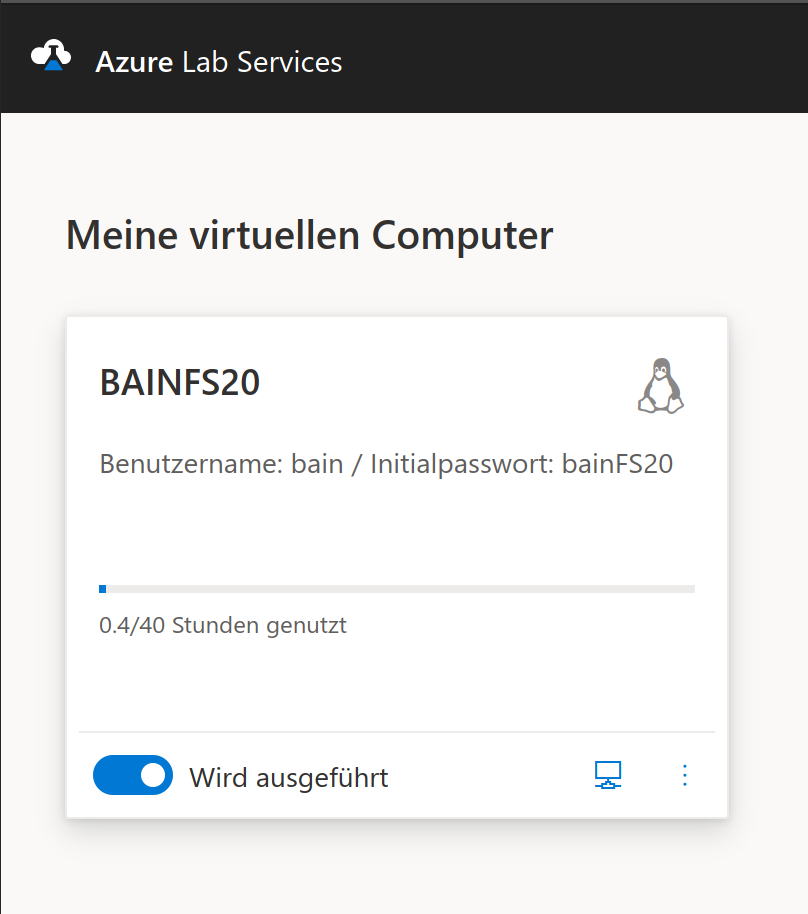

# Sitzung 1

Datum: 13.03.2020

### Thema: Technische Grundlagen

Einrichtung der Arbeitsumgebung (Linux)

Nach ein paar ersten technischen Abklärungen haben wir uns daran  gemacht, eine virtuelle Linux-Maschine (Ubuntu 19.04 mit Xfce-Desktop) auf einer extra für die Klasse gemieteten Azure Workstation/Server zu  installieren. Wie es bei Microsoft oftmals vorkommt, haben sich viele von uns mit dem Microsoft-Account bzw. dem Login abgemüht, das für den  Azure-Zugang nötig ist. Da die Schul-Acounts partout nicht funktionierten, haben die meisten Studenten letzlich eine private Adresse verwendet.

Wir melden uns also mit unserem Microsoft-Account an und finden unsere assoziierten virtuellen Maschinen unter https://labs.azure.com/. Von dort aus können wir die Maschine entfernt hochfahren. Das Einloggen und Anzeigen des Systems erfolgt dann entweder per SSH im CLI (Command Line Interface) oder grafisch über das Remote Desktop-Protokoll. 

Grundlagen der Unix Shell

Versionskontrolle mit Git