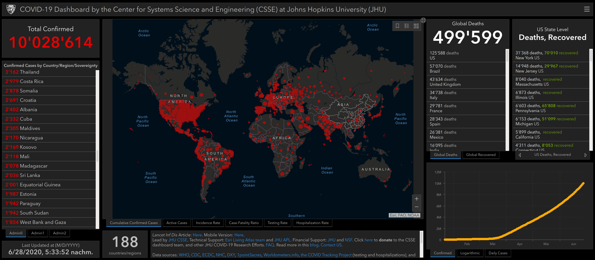

# Sitzung 2

Datum: 03.04.2020

### Thema: Funktion und Aufbau von Bibliothekssystemen

Das grosse Thema der heutigen Sitzung (03.04.2020) ist die Funktion und der Aufbau von Bibliothekssystemen. 

#### Datenvisualisierung

Bevor wir nun aber in das Hauptthema der Sitzung vordringen, haben wir ein sehr aktuelles Thema vorneweg angeschaut, nämlich Datenvisualisierungen und zwar zu folgendem: 

It will go down in history – CORONA, das Virus [SARS-CoV-2](https://de.wikipedia.org/wiki/SARS-CoV-2), das mit Lockdowns in fast allen Ländern die Welt lahm legt und uns vor die Bildschirme zuhause ins WebEx Meeting verlegt hat.

Wir besprechen also als Warm-Up gewissermassen erst die aktuellen und populärsten Datenvisualisierungen zum Virus, wie sie beispielsweise hier zu finden sind:

- [Tagesspiegel](https://interaktiv.tagesspiegel.de/lab/die-globale-verbreitung-des-coronavirus-im-zeitverlauf/)
- [Johns Hopkins University](https://coronavirus.jhu.edu/map.html)
- [NCOV](https://ncov2019.live/data)
- [Bundesamt für Gesundeheit Schweiz (BAG)](https://covid-19-schweiz.bagapps.ch/de-1.html)

Ich persönlich kann mich der Meinung der Mehrzahl der Studierenden anschliessen, dass die Johns Hopkins Universität eine sehr ausgereifte, interaktive Statistik-Karte geschaffen hat. Wenn es um die Zahlen und sonstige Informationen zum Thema geht, bin ich jedoch eher konservativ und höre mir an, was unser BAG dazu meldet. Schliesslich gehe ich davon aus, dass dort die Zahlen und Fakten aus erster “Messungshand” stammen und sehr aktuell sind. Allerdings ist es ja bei diesem Virus ohnehin so, dass nicht alle positiven Fälle in die Statistik kommen, da nur Menschen mit Symptomen überhaupt getestet werden und viele junge Menschen, das Virus zwar tragen können, aber gar nichts davon merken. Insofern fragt man sich, wie die Statistik überhaupt gelesen werden muss und wie aussagekräftig das Ganze ist.

Screenshot aktualisiert vom 28.6.20 ([Johns Hopkins University](https://coronavirus.jhu.edu/map.html))

