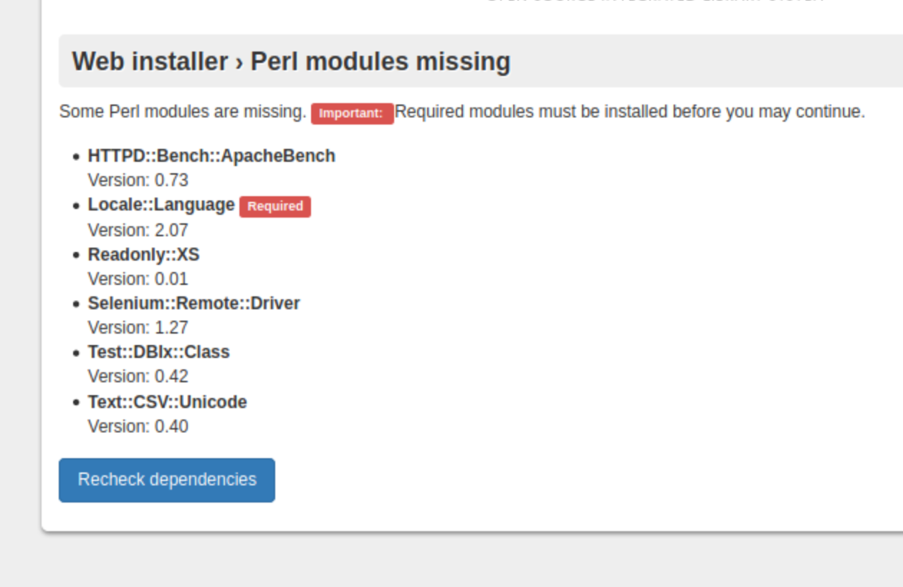
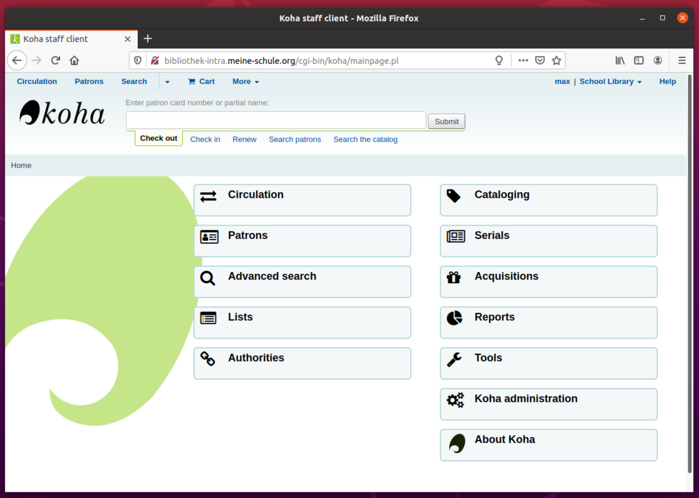
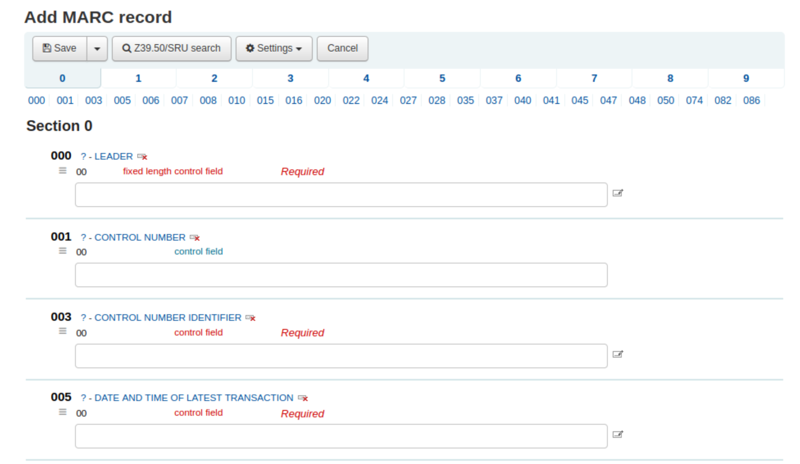

# Sitzung 2

Datum: 03.04.2020

### Thema: Funktion und Aufbau von Bibliothekssystemen

Das grosse Thema der heutigen Sitzung (03.04.2020) ist die Funktion und der Aufbau von Bibliothekssystemen. 

#### Datenvisualisierung

Bevor wir nun aber in das Hauptthema der Sitzung vordringen, haben wir ein sehr aktuelles Thema vorneweg angeschaut, nämlich Datenvisualisierungen und zwar zu folgendem: 

It will go down in history – CORONA, das Virus [SARS-CoV-2](https://de.wikipedia.org/wiki/SARS-CoV-2), das mit Lockdowns in fast allen Ländern die Welt lahm legt und uns vor die Bildschirme zuhause ins WebEx Meeting verlegt hat.

Wir besprechen also als Warm-Up gewissermassen erst die aktuellen und populärsten Datenvisualisierungen zum Virus, wie sie beispielsweise hier zu finden sind:

- [Tagesspiegel](https://interaktiv.tagesspiegel.de/lab/die-globale-verbreitung-des-coronavirus-im-zeitverlauf/)
- [Johns Hopkins University](https://coronavirus.jhu.edu/map.html)
- [NCOV](https://ncov2019.live/data)
- [Bundesamt für Gesundeheit Schweiz (BAG)](https://covid-19-schweiz.bagapps.ch/de-1.html)

Ich persönlich kann mich der Meinung der Mehrzahl der Studierenden anschliessen, dass die Johns Hopkins Universität eine sehr ausgereifte, interaktive Statistik-Karte geschaffen hat. Wenn es um die Zahlen und sonstige Informationen zum Thema geht, bin ich jedoch eher konservativ und höre mir an, was unser BAG dazu meldet. Schliesslich gehe ich davon aus, dass dort die Zahlen und Fakten aus erster “Messungshand” stammen und sehr aktuell sind. Allerdings ist es ja bei diesem Virus ohnehin so, dass nicht alle positiven Fälle in die Statistik kommen, da nur Menschen mit Symptomen überhaupt getestet werden und viele junge Menschen, das Virus zwar tragen können, aber gar nichts davon merken. Insofern fragt man sich, wie die Statistik überhaupt gelesen werden muss und wie aussagekräftig das Ganze ist.


*Screenshot aktualisiert vom 28.6.20 ([Johns Hopkins University](https://coronavirus.jhu.edu/map.html))*


### Installation und Konfiguration von Koha

[Koha](https://koha-community.org/) ist ein webbasiertes integriertes Bibliothekssystem, das weltweit durch viele öffentliche Bibliotheken und Archive zum Einsatz kommt. Die Software ist komplett open-source. Es ist besonders auf Skalierbarkeit ausgelegt und bedient sich einer SQL-Datenbankanbindung (vorzugsweise MySQL oder MariaDB). Koha verfügt über die üblichen Funktionen integrierter Bibliothekssysteme wie die Verwaltung von Umläufen und Ausleihen,  Bestandsverwaltung und Unterstützung für Periodika wie Zeitschriften und Zeitungen ([Wikipedia, 2020](https://de.wikipedia.org/wiki/Koha_(Bibliothekssoftware))). 

Wie bereits erwähnt, lief die Azure VM bei mir nur sehr stotternd und war teilweise einfach nicht so richtig zu gebrauchen. Deshalb entschied ich mich, obwohl bereits auf dem Remote Desktop installiert (19.11), das neue Koha 20.05 nochmals in einer Ubuntu-Server-VM auf meinem System zu installieren (via [GNOME Boxes](https://covid-19-schweiz.bagapps.ch/de-1.html)). Ich habe dazu das aktuelle Ubuntu Server Live 20.04 LTS verwendet und bin gewöhnlich der Installationsanleitung im [Padlet](https://pad.gwdg.de/Pc0xEV7zSh2wBKLFvjgAow?both#Installation-und-Konfiguration-von-Koha) gefolgt. Der Aufruf der Seite [http://bibliothek-intra.meine-schule.org/](http://bibliothek-intra.meine-schule.org/) gelingt hier zwar auf Anhieb, jedoch meldet Koha ein fehlendes Perl-Modul; nämlich jenes der Sprachen (locales). 



*Fehlendes Perl-Modul beim Aufsetzen von Koha 20.05 unter Ubuntu Server 20.04*

Nach viel zu lange dauernder Recherche konnte ich das Problem durch Nachrüsten eines spezifischen Paketes letzendlich lösen:

```
$ sudo apt install liblocale-codes-perl
```

Weshalb dieses nicht in der Standard-Perl-Distribution enthalten ist, bleibt mir schleierhaft. Nun denn, auf ins Koha-Land!



In Koha kann man so ziemlich alles tun, was man von einer Bibliotheksverwaltung erwarten kann. Da ich – wie gesagt – weder in einer Bibliothek noch in einem Archiv arbeite, kenne ich mich mit diesen Systemen leider nicht sonderlich aus. Von MARC21 als Katalogisierungsstandard habe ich natürlich auch schon gehört bzw. einen solchen Record mal angeschaut, aber ich denke, man muss ernsthaft im Alltag damit arbeiten, um etwas sinnvolles darüber sagen zu können. 

Während des Unterrichts konnten wir uns auch nach Einleitung an kleinen Übungen messen, wie man neue Benutzer anlegt, ein Buch katalogisiert oder einen Barcode hinzufügt, was auch keine grösseren Schwierigkeiten verursacht hat. Das GUI von Koha war hierbei glücklicherweise sehr selbsterklärend. Ich wurde von einem Studienkollegen noch darauf hingewiesen, dass man in Koha sogenannte MARC-Frameworks anlegen kann. Diese geben vor, welche Felder bei der Katalogisierung ausgefüllt werden müssen und steuern gleichzeitig welche MARC-Felder überhaupt angezeigt werden. Es gibt eine Reihe vordefinierter Frameworks, welche auch im [Koha-Wiki](https://wiki.koha-community.org/wiki/MARC_frameworks) heruntergeladen werden können. Dies erschien mir als spezielles Feature besonders wertvoll und es erleichtert mit Sicherheit auch die Arbeit beim Katalogisieren. 



*Hinzufügen/Katalogisieren eines neuen MARC-Bestandes*

Es wird in Zukunft bestimmt interessant zu sehen sein, was aus dem wohl etablierten MARC21 passiert. Ob grosse ILS (Integrated Library Systems) dem Trend folgen werden und auch auf das neue, vielversprechende [BIBFRAME](https://www.loc.gov/bibframe/) setzen werden, das durch Linked Open Data den Anschluss ans Semantic Web sucht? Konversionstools stehen auf jeden Fall schon bereit: https://www.loc.gov/bibframe.

Alles in allem, war es sehr spannend, mal ein solches Tool “von innen” kennenzulernen – gerade auch als Nicht-Bibliothekar. 

------
<div class="site-nav">
<a href="./Sitzung01.html">< vorheriger Blog</a>
<a href="./Sitzung03.html">nächster Blog ></a>
</div>