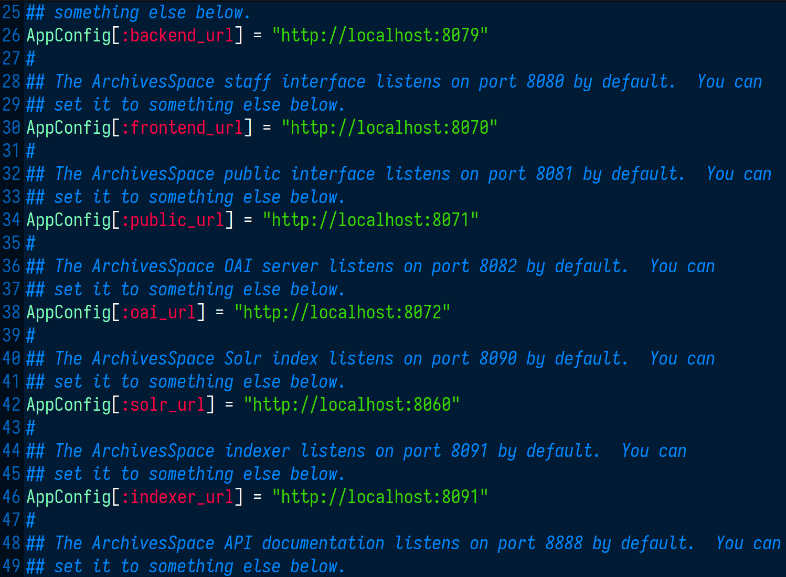
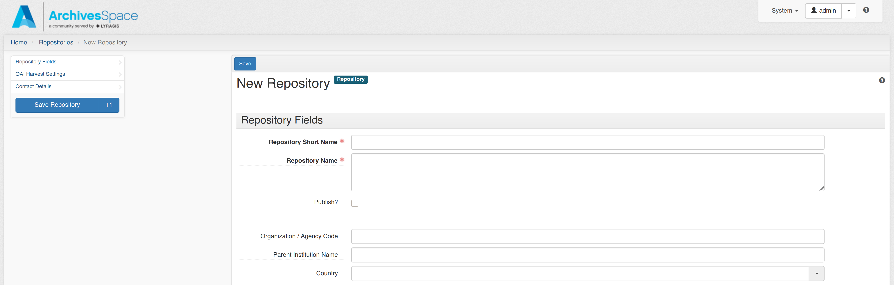

# Sitzung 3

Datum: 25.04.2020

## Funktion und Aufbau von Archivsystemen

Sitzung 3 ist voll und ganz der Funktion und dem Aufbau von Archivsystemen gewidmet. Wurde bisher also mit bspw. Koha der Fokus auf die Bibliothek gelegt, erkunden wir in dieser Sitzung die Informationssysteme  der Archivare und Archive. Dabei ist es natürlich unerlässlich nochmals die Standards und Regelwerke der Archivsysteme zu konsultieren. Wir hatten dies als Klasse bereits in vorangegangen Modulen behandelt, doch es war auf jeden Fall ein guter «Refresh» für einen Nicht-Archivar wie mich. 

## Metadatenstandards in Archiven (ISAD(G) und EAD)

Zu Beginn der Sitzung standen also die Metadatenstandards der Archive im Fokus. Für mich bedeutete dies eine Repetition, die jedoch durchaus nötig war:

**ISAD(G)**:

- Ein wichtiger Verzeichnungsstandard im Archivwesen wurde 1994 (Revision 2000) eingeführt, die "International Standard Archival Description (General)" - kurz [ISAD(G)](https://de.wikipedia.org/wiki/ISAD(G)).
- Es existiert eine mehrstufige Verzeichnung im Provenienzprinzip, um den Entstehungszusammenhang abzubilden.

Der Standard enthält 26 Verzeichnungselemente in 7 Informationsbereichen:

1. Identifikation
2. Kontext
3. Inhalt und innere Ordnung
4. Zugangs- und Benutzungsbedingungen
5. Sachverwandte Unterlagen
6. Anmerkungen
7. Kontrolle

Von besonderer Bedeutung sind 6 Pflichtfelder:

- Signatur
- Titel
- Provenienz
- Entstehungszeitraum
- Umfang
- Verzeichnungsstufe

Da der Standard bereits 1994 verabschiedet wurde, ist er in seiner damaligen Ausprägung den heutigen Anforderungen nicht mehr ganz gewachsen. Beispielsweise gibt es keine Möglichkeit zur Mehrfachzuordnung, da die Tektonik eindimensional angelegt ist. Oder es fehlen Vorgaben zur digitalen Langzeitarchivierung. Hier könnte beispielsweise eine Anknüpfung an Vorgaben aus dem [OAIS-Referenzmodell](https://de.wikipedia.org/wiki/OAIS) stattfinden.

Aktuell ist ein neuer Standard ["Records in Contexts" (RIC)](https://de.wikipedia.org/wiki/Records_in_Contexts) in Entwicklung. Dieser basiert auf Linked-Data-Prinzipien und soll neue und mehrfache Beziehungen zwischen Entitäten ermöglichen.

**EAD**:

- [Encoded Archival Description](https://de.wikipedia.org/wiki/Encoded_Archival_Description) (EAD) ist ein XML-Standard
- Verschiedene Versionen: EAD2002 und EAD3 (August 2015 veröffentlicht)

Offizielle Website an der Library of Congress: [EAD](https://www.loc.gov/ead/)


## Installation und Konfiguration von ArchivesSpace

Da mir das System auf dem Azure Lab Remote Desktop hier wieder zu langsam war, habe ich ArchivesSpace auf dem eigenen Rechner installiert. Dieses Mal war es jedoch wesentlich einfacher, da letztendlich nur das Java Runtime Environment 8 als Abhängigkeit installiert werden musste (*jre8-openjdk-headless* für Arch Linux basierte Distros). Ich installierte die Software also direkt in meiner Manjaro-Distribution. Der Rest der Installation besteht aus dem Herunterladen und Entpacken eines Zip-Archivs. Danach kann das Ganze via 

```
$ ./archivesspace.sh
```

im entsprechenden Verzeichnis über das Shell-Skript gestartet werden. Da ich aus irgendeinem Grund noch die Default-Ports von einer anderen Applikation belegt hatte, wechselte ich diese jeweils auf 8070, 8071, etc. statt 8080, 8081 usw. in config/config.rb, was dann auch bestens klappte.



*Verändern der Default Ports in config.rb*



*Neues Repository in ArchivesSpace anlegen*


## Installation und Konfiguration von DSpace

