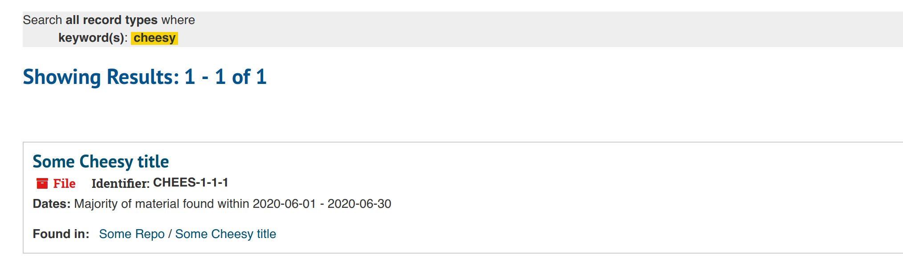

# Sitzung 3

Datum: 25.04.2020

## Funktion und Aufbau von Archivsystemen

Sitzung 3 ist voll und ganz der Funktion und dem Aufbau von Archivsystemen gewidmet. Wurde bisher also mit bspw. Koha der Fokus auf die Bibliothek gelegt, erkunden wir in dieser Sitzung die Informationssysteme  der Archivare und Archive. Dabei ist es natürlich unerlässlich nochmals die Standards und Regelwerke der Archivsysteme zu konsultieren. Wir hatten dies als Klasse bereits in vorangegangen Modulen behandelt, doch es war auf jeden Fall ein guter «Refresh» für einen Nicht-Archivar wie mich. 

## Metadatenstandards in Archiven (ISAD(G) und EAD)

Zu Beginn der Sitzung standen also die Metadatenstandards der Archive im Fokus. Für mich bedeutete dies eine Repetition, die jedoch durchaus nötig war:

**ISAD(G)**:

- Ein wichtiger Verzeichnungsstandard im Archivwesen wurde 1994 (Revision 2000) eingeführt, die "International Standard Archival Description (General)" - kurz [ISAD(G)](https://de.wikipedia.org/wiki/ISAD(G)).
- Es existiert eine mehrstufige Verzeichnung im Provenienzprinzip, um den Entstehungszusammenhang abzubilden.

Der Standard enthält 26 Verzeichnungselemente in 7 Informationsbereichen:

1. Identifikation
2. Kontext
3. Inhalt und innere Ordnung
4. Zugangs- und Benutzungsbedingungen
5. Sachverwandte Unterlagen
6. Anmerkungen
7. Kontrolle

Von besonderer Bedeutung sind 6 Pflichtfelder:

- Signatur
- Titel
- Provenienz
- Entstehungszeitraum
- Umfang
- Verzeichnungsstufe

Da der Standard bereits 1994 verabschiedet wurde, ist er in seiner damaligen Ausprägung den heutigen Anforderungen nicht mehr ganz gewachsen. Beispielsweise gibt es keine Möglichkeit zur Mehrfachzuordnung, da die Tektonik eindimensional angelegt ist. Oder es fehlen Vorgaben zur digitalen Langzeitarchivierung. Hier könnte beispielsweise eine Anknüpfung an Vorgaben aus dem [OAIS-Referenzmodell](https://de.wikipedia.org/wiki/OAIS) stattfinden.

Aktuell ist ein neuer Standard ["Records in Contexts" (RIC)](https://de.wikipedia.org/wiki/Records_in_Contexts) in Entwicklung. Dieser basiert auf Linked-Data-Prinzipien und soll neue und mehrfache Beziehungen zwischen Entitäten ermöglichen.

**EAD**:

- [Encoded Archival Description](https://de.wikipedia.org/wiki/Encoded_Archival_Description) (EAD) ist ein XML-Standard
- Verschiedene Versionen: EAD2002 und EAD3 (August 2015 veröffentlicht)

Offizielle Website an der Library of Congress: [EAD](https://www.loc.gov/ead/)


## Installation und Konfiguration von ArchivesSpace

Da mir das System auf dem Azure Lab Remote Desktop hier wieder zu langsam war, habe ich ArchivesSpace auf dem eigenen Rechner installiert. Dieses Mal war es jedoch wesentlich einfacher, da letztendlich nur das Java Runtime Environment 8 als Abhängigkeit installiert werden musste (*jre8-openjdk-headless* für Arch Linux basierte Distros). Ich installierte die Software also direkt und lokal in meiner Manjaro-Distribution. Der Rest der Installation besteht aus dem Herunterladen und Entpacken eines Zip-Archivs. Danach kann das Ganze via 

```
$ ./archivesspace.sh
```

im entsprechenden Verzeichnis über das Shell-Skript gestartet werden. Da ich aus irgendeinem Grund noch die Default-Ports von einer anderen Applikation belegt hatte, wechselte ich diese jeweils auf 8070, 8071, etc. statt 8080, 8081 usw. in config/config.rb, was dann auch bestens klappte.


*Verändern der Default Ports in config.rb*


*Neues Repository in ArchivesSpace anlegen*

Auch in ArchivesSpace unternehmen wir wieder einige Versuche unterschiedliche Records anzulegen. Nachdem in einem ersten Schritt ein Repository angelegt werden muss, können danach auch einzelne Dokumente darin angelegt werden. Nach erfolgreicher Veröffentlichung können wir auch eine Suche im öffentlichen Interface unter localhost:8081 bzw. in meinem Fall localhost:8071 ausführen. 



Die Ausgestaltung des Interface überzeugt mich hier sogar noch etwas mehr als dies bei Koha der Fall war. Da ich mich mit der Archivwissenschaft trotz dem Studium kaum auskenne, fällt es mir jedoch schwer etwas über die Qualität der Software auszusagen. Die einfache portable Installation und die Schnittstelle überzeugen auf jeden Fall schon mal und ich könnte mir bestimmt vorstellen, damit zu arbeiten. 

## Installation und Konfiguration von DSpace

Am Nachmittag haben wir uns im Rahmen des Themas «Repository-Software für Publikationen und Forschungsdaten» mit [Open Access](https://de.wikipedia.org/wiki/Open_Access) und [Open Data](https://de.wikipedia.org/wiki/Open_Data) beschäftigt und dazu passend mit der [Demo-Installation von DSpace](https://demo.dspace.org/) gearbeitet. 

Die «Open-Access-Thematik» hatten wir glücklicherweise bereits in vorangegangen Modulen als Unterrichtsstoff, sodass ich diesbezüglich glücklicherweise auf keine allzu grossen Wissenslücken stossen musste. Von DSpace hatte ich damals schon gehört, damit gearbeitet jedoch noch nie. Deshalb hatte ich mich grundsätzlich darüber gefreut, hier mal Einblick zu erhalten.

Auf nach DSpace also! Eine interessante Dokumentation bzw. ein Wiki findet sich übrigens [hier](https://wiki.lyrasis.org/display/DSPACE).

Ich habe, von den beiden zur Verfügung stehenden GUI-Varianten die [JSPUI(JSP)](https://demo.dspace.org/jspui/) gewählt, da es visuell einen etwas ansprechenderen Look vermittelte. Anmelden im Demo-Account kann man sich über die folgenden Rollen:

- Site Administrator: `dspacedemo+admin@gmail.com`
- Community Administrator: `dspacedemo+commadmin@gmail.com`
- Collection Administrator: `dspacedemo+colladmin@gmail.com`
- Submitter: `dspacedemo+submit@gmail.com`
- Passwort immer: `dspace`

Wir nehmen natürlich das «Vollpaket» und melden uns als Site Administrator an ;-)

Unser erstes Ziel besteht darin eine Community anzulegen und darin eine erste Collection.


Die Community bildet dabei gewissermassen die institutionelle Zuordnung der zu veröffentlichenden Forschungsdaten. Wir schaffen uns also einen Container für unser Goldfisch-Departement. 

Darin enthalten eröffnen wir uns die erste Collection. Wir wählen dazu noch ein paar Optionen mehr aus, damit wir auch mehr vom Funktionsumfang erfahren.


Wir haben nun auch die Möglichkeit der Collection bereits vordefinierte DC-Felder (Dublin Core Metadaten-Standard) zuzuordnen.


Nun ist unsere Collection erstellt und wir können damit beginnen, diese zu befüllen.


Das Interface ist rundum selbsterklärend erstellt und optionale Parameter könne auch zu einem späteren Zeitpunkt noch ergänzt werden. Der File-Upload ebenfalls sehr intuitiv gestaltet. Man versteht hier langsam, weshalb DSpace einen so hohen Stellenwert bei Universitätsbibiotheken erreicht hat. Auch das Lizenz- und Nutzungsbestimmungsmanagement scheint hier sehr umfangreich und sorgfältig elaboriert worden zu sein, was natürlich auch unbedingt eine Anforderung ist, wenn es um Open-Access-Forschungsdaten geht.


Wer bereits veröffentlichte Datensätze nach DSpace importieren will, kann das übrigens auch ganz einfach über die Angabe der DOI (Digital Object Identifier) machen. 

Insbesondere toll in DSpace, ist unter anderem auch die Möglichkeit über eine [OAI-PMH](https://www.openarchives.org/pmh/)-Schnittstelle das Harvesting externer Systeme zu erlauben. So wäre bspw. eine Anzeige der auf DSpace veröffentlichten Daten über einen Harvester wie [BASE](https://www.base-search.net/) (Bielefeld Academic Search Engine) denkbar. 

------
<div class="site-nav">
<a href="./Sitzung02.html">< vorheriger Blog</a>
<a href="./Sitzung04.html">nächster Blog ></a>
</div>