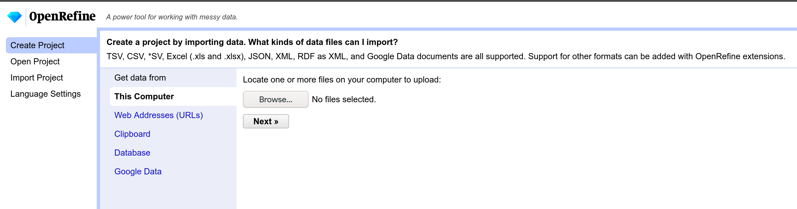
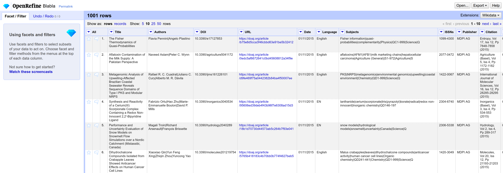
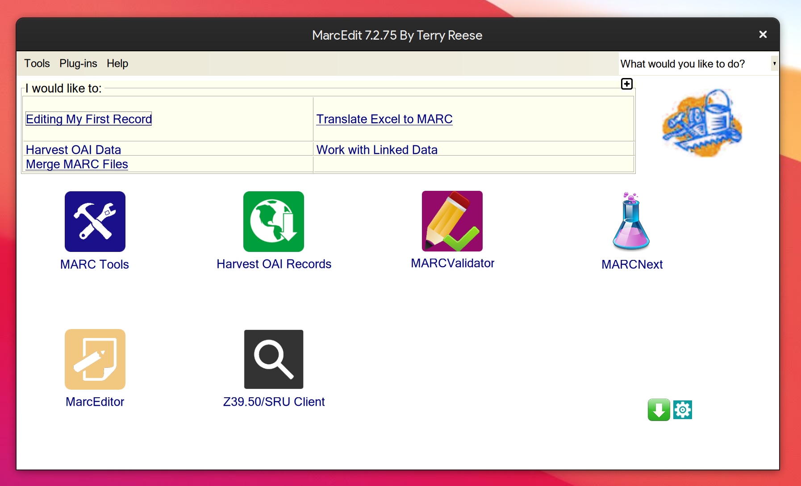
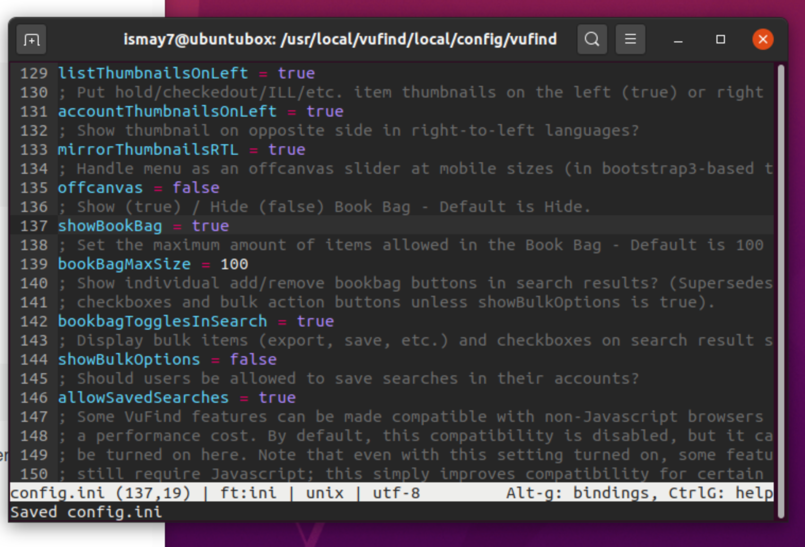
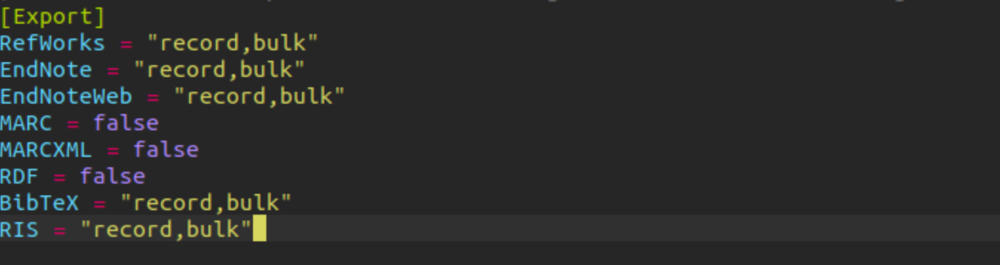

# Sitzung 4

Datum: 05.06.2020

### Thema: Metadaten modellieren und Schnittstellen nutzen

Im heutigen Block dreht sich alles um die Modellierung von Metadaten und die Nutzung dazu passender Schnittstellen. Wir werden Einblick in die Tools [OpenRefine](https://openrefine.org/), [MarcEdit](https://marcedit.reeset.net/) und [Solr](https://lucene.apache.org/solr/) erhalten. Wir hatten auch die Möglichkeit, uns über Tutorials der Library Carpentry noch vertiefter mit diesen Werkzeugen zu beschäftigen, wofür mir im letzten Semester leider nicht allzu viel Zeit blieb:

- [Library Carpentry Lesson zu OpenRefine](https://librarycarpentry.org/lc-open-refine/) 
- [Library Carpentry Lesson zu MarcEdit](https://librarycarpentry.org/lc-marcedit/01-introduction/index.html)
- [Solr Tutorial](https://lucene.apache.org/solr/guide/8_5/solr-tutorial.html)

### OpenRefine

OpenRefine ist eine webbasierte Cross-Plattform-Software (Linux, Windows, MacOS) für die Bearbeitung von Metadaten bzw. deren Dateien. Es kann mit folgenden Formaten arbeiten: TSV, CSV, SV, Excel (.xls and .xlsx), JSON, XML, RDF als XML, und Google-Daten-Dokumenten. Die Installation in meinem Fall erfolgte nativ auf Linux durch die Installation des [openrefine-Paketes](https://aur.archlinux.org/packages/openrefine/) aus dem AUR (Arch User Repository).

Gestartet wird das Programm bei mir im Terminal durch den Befehl ```openrefine```. Anschliessend öffnet sich der Browser im localhost unter Port 3333 und die Benutzeroberfläche von OpenRefine wird angezeigt. 



Um einen kurzen Einblick in den Funktionsumfang des Programms zu erhalten, importieren wir den Beispiel-Datensatz aus dem Library Carpentry Tutorial (eine CSV-Datei) und setzen zusätzlich das Encoding auf UTF-8. Wir sehen unseren Datensatz nun folgendermassen:




Das Programm eignet sich hervorragend für Tabellen-orientierte Formate, aber auch XML oder JSON können bequem editiert werden. Ein nettes Feature ist insbesondere die Bearbeitung direkt über die Spalten, wo sogenannte «Facets» (Filter) angewendet werden können. Diese ermöglichen es einen, die Datenstruktur in sogennate Subsets zu filtern, was mir sehr nützlich erscheint.

Alles in allem, bin ich froh, dass ich dieses Wekzeug kennenlernen durfte. Ich kann mir vorstellen, dass ich dieses auch beruflich oder privat (ich habe viele Tabellen im CSV-Format vorliegen) mal gebrauchen werde.

### MarcEdit

MarcEdit ist eine Metadaten-Bearbeitungs-Suite, die ursprünglich von Terry Reese 1999 für ein Datenbank-Bereinigungs-Projekt an der Oregon State University entwickelt. Später wurde es dann für die allgemeine Benutzung unter einer freien lizenz zur Verfügung gestellt. Via [XSLT](https://en.wikipedia.org/wiki/XSLT) (Extensible Stylesheet Language Transformations) können auch über das [Z39.50](https://en.wikipedia.org/wiki/Z39.50)-Protokoll Daten auf enfernten Servern eingeholt werden, um dann deren Daten in einem anderen Metadaten-Schema abzubilden.

Der Installations-Vorgang bei MarcEdit auf Linux gestaltete sich leider etwas mühseliger, da zusätzlich die MONO-Umgebung benötigt installiert werden muss (abgesehen von der Grösse, OK) und der Installer dann entsprechend eine .run-Datei ist, die ein Verzeichnis installiert, von wo aus man dann wiederum die .desktop-Datei suchen muss, um das Programm zu starten. Ein vorgefertiges Binary oder Distributions-Paket konnte ich leider nicht finden – zumindest nicht für Arch-basierte Distros. 

Die RUN-Datei muss zusätzlich mit Executable-Rechten versehen werden, ehe sie gestartet werden kann. 

```
$ chmod +x marcedit7.run
```

Einmal gestartet, erhalten wir gleich mehrere Funktionen, wie wir mit unseren MARC-Datensätzen verfahren können. 



Unter MARC Tools können wir ein MARC21XML zurück ins MARC-Format wandeln (.mrc) – um hier mal ein Beispiel zu nennen. Der Versuch über das Tool gelang mir in dieser Installation aber leider nicht. Wahrscheinlich passierte dies, weil ich das Programm nur mit Root-Rechten installieren konnte. So wurde die neue Datei zwar erzeugt, aber war entsprechend leer. Nun denn…

Es ist auch möglich über “Harvest OAI Records” von einem Server Open-Access-Metadaten zu sammeln und in einer Datei zu speichern. Oder Marc-Dateien über einen Validator auf seine Wohlgeformtheit bzw. Konformität mit den Standards hin zu prüfen. 

MarcEdit ist im wahrsten Sinne des Wortes eine Suite – also eine sehr umfangreiche Sammlung an Werkzeugen zum Umgang mit Medaten-Schemata. Der Fokus liegt jedoch stark bei MARC und dessen «Verwandten».

### Solr

Solr konnte ich aus zeitlichen Gründen leider kaum mehr anschauen, ist jedoch Bestandteil von VuFind und findet daher trotzdem Eingang ins Geschehen. 

### VuFind

VuFind ist ein bibliothekarisches Suchsystem, das an der [Villanova University](https://de.wikipedia.org/wiki/Villanova_University) (USA) als [freie Software](https://de.wikipedia.org/wiki/Freie_Software) entwickelte [Discovery-System](https://de.wikipedia.org/wiki/Discovery-System) stellt dem Benutzer eine einfache Suchmaske bereit und kann einen herkömmlichen [OPAC](https://de.wikipedia.org/wiki/OPAC) (Online Public Access Catalogue) ablösen bzw. auch mehrere OPACs und andere Quellen zusammenfassen.

Die Installation unternehme ich abermals in meiner Ubuntu Server VM, da es keine Pakete für Arch Linux gibt, da dieses ohnehin extrem selten als Server benutzt wird. Dank den [Instruktionen](https://vufind.org/wiki/installation:ubuntu) für Ubuntu gelingt das auch relativ problemlos. 


Desweiteren folgen wir dem Tutorial von Felix Lohmeier [hier](https://felixlohmeier.gitbooks.io/vufind-tutorial-de/content/04_Installation_Testimport.html) (Kapitel 4-9).

Der Testimport gelingt problemlos und war, wie ich finde sehr schnell, obschon dieser nochmals optmiert werden konnte via

```
php /usr/local/vufind/util/optimize.php
```

Dies sollte übrigens nach jedem Datenbank-Import erfolgen.

Im Anschluss kopieren wir uns noch die fehlende ```facets.ini``` (Facetten-Konfigutrationsdatei) mit vielen Optionen in unser lokales Vufind-Verzeichnis, um diese dort später zu verändern.

```
cp /usr/local/vufind/config/vufind/facets.ini /usr/local/vufind/local/config/vufind
```

Erstmals geht es jedoch in die Hauptkonfigurations-Datei ```config.ini``` , wo wir – einfach zum Spass – mit 

```
showBookBag = true
```

die Merklisten-Funktion aktivieren, indem wir den Wert von false auf true setzen:



Diese ist nun auch auf der Suchresultseite bei den Treffern jeweils zu sehen:


In der Folge aktivieren wir ebenfalls die per Default ausgeschaltete Mehrfachauswahl:

```
showBulkOptions = true
```

Im Anschluss entscheiden wir noch, welche Exportformate zur Verfügung stehen sollen. Ich entscheide mich für die zusätzlichen Exportformate BibTex (unbedingt!) und RIS. Wir setzen die Werte im Abschnitt [Export] also folgendermassen um:



Statt “false” haben wir nun ebenfalls stehen: “record,bulk”.

Als Resultat haben wir nun nicht nur die Mehrfachauswahl, sondern können uns die Einträge auch gleich noch ins freigeschaltete BibTex-Format exportieren:


Als Nächstes holen wir uns noch die Einzelseiten-Navigation, um von einem Treffer in der Einzelansicht auf den nächten oder vorhergehenden zu gelangen:

```
next_prev_navigation = true
```

### Fazit VuFind

Gefällt mir also sehr gut! ich konnte zwar die restlichen Aufgaben aus Zeitgründen nicht mehr lösen, aber es ginge in diesem Stil weiter. So lässt sich die Benutzeroberfläche von VuFind bspw. auch bis ins Detail anpassen, über bereits vorhandene Themes oder auch eigene erstellen.

------
<div class="site-nav">
<a href="./Sitzung03.html">< vorheriger Blog</a>
<a href="./Sitzung05.html">nächster Blog ></a>
</div>