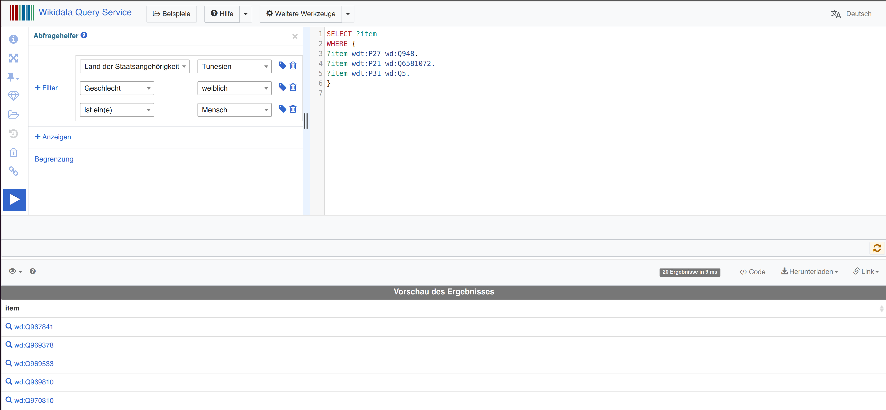
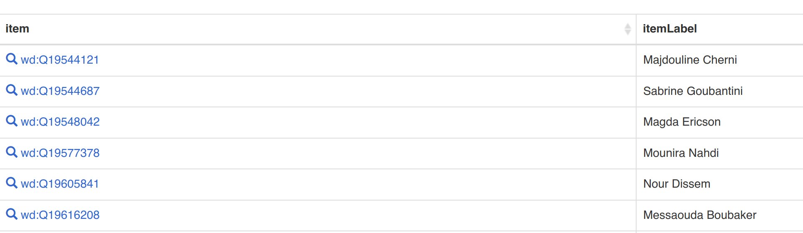
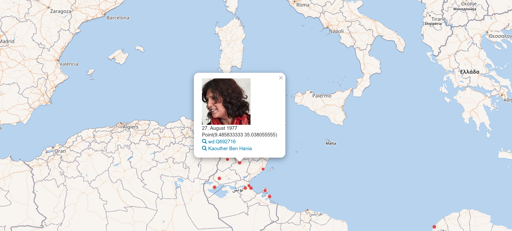

# Sitzung 5

Datum: 06.06.2020

### Thema: Suchanfragen mit SPARQL am Beispiel des Wikidata Query Service

Die letzte Sitzung startet wie immer mit einer Recap der vorherigen Sitzung und wir diskutieren in der Klasse noch etwaige Probleme bei VuFind. 

Das heutige Thema ist neben der Unterrichtsevaluierung zum Schluss ganz dem Thema der Suchanfragen gewidmet. Wir zentrieren uns rund um SPARQL – ein Thema, das unsere Klasse bereits im Modul SESY (Semantische Systeme für Informationsverarbeitung) kennenlernen durfte. In einer Gruppenarbeit, die als Leistungsnachweis eine Seminararbeit zur virtuellen Bibliothek [Europeana](https://www.europeana.eu/de) zur Folge hatte, konnten wir bereits SPARQL-Suchabfragen in deren [API](http://sparql.europeana.eu/) tätigen.

Hier die wichtigsten Links zum Thema und den Übungen:

- Handout zum Query Service: https://www.wikidata.org/wiki/File:Wikidata_Query_Service_kurzgefasst.pdf
- Query-Service: https://query.wikidata.org (dort integrierte Beispiele)
- Weitere Beispiele: https://blog.wikimedia.de/2016/10/30/10-coole-wikidata-abfragen-die-dir-neue-horizonte-eroeffnen-nummer-7-wird-dich-schockieren/
- [Das Tutorial](https://medium.com/freely-sharing-the-sum-of-all-knowledge/writing-a-wikidata-query-discovering-women-writers-from-north-africa-d020634f0f6c)

Sparql ist eine [graphenbasierte](https://de.wikipedia.org/wiki/Graph_(Graphentheorie)) [Abfragesprache](https://de.wikipedia.org/wiki/Abfragesprache) für [RDF](https://de.wikipedia.org/wiki/Resource_Description_Framework). Der Name ist ein [rekursives Akronym](https://de.wikipedia.org/wiki/Rekursives_Akronym) für **S**PARQL **P**rotocol **A**nd **R**DF **Q**uery **L**anguage. 

Quelle: ([Wikipedia, 2020](https://de.wikipedia.org/wiki/SPARQL))

In einem kurzen Beispiel, das aus dem oben genannten Tutorial stammt, können wir eine Abfrage im RDF-Graphen von der Wikimedia Foundation tätigen. Wir begeben uns zum [Wikidata Query Service](https://query.wikidata.org), wo wir gleich den fast schon unabdingbaren Abfragehelfer aktivieren, indem wir auf das Informations-Icon in der linken Leiste klicken. Wir geben nun unsere Beispiel-Abfrage aus dem Tutorial in den Query-Code-Bereich auf der rechten Seite ein und erhalten durch Klicken auf das blaue Play-Symbol die Antworten im unteren Bereich. Die Sprache funktioniert ähnlich wie oder erinnert zumindest in ihrer Formulierung stark an SQL.



Mit ```SELECT``` beginnen wir einen Filter, den wir mit spezifischen ```?item```-Anfragen (Artikeln, Personen, etc.) weiter eingrenzen. Die Codes ```wdt:P27``` oder ```wd:Q948  ``` fungieren als die Eigenschaften, nach denen speziell gefiltert soll. In unserem Fall also die “Staatszugehörigkeit Tunesien”, dass es ein Mensch sein soll und dass dieser weiblich sein soll. Dies ergibt bereits eine kleine Liste mit 20 Treffern. Die Liste ist jedoch immer noch in diesen unlerslichen Wiki-Codes. Es gibt jedoch Abhilfe. Wir ergänzen unsere Suchanfrage mit folgendem Parameter:

```
SERVICE wikibase:label { bd:serviceParam wikibase:language "[AUTO_LANGUAGE],en".}
```

Die neue Resultatseite ist nun weitaus leserlicher:



Doch das ist noch lange nicht das Ende der Fahnenstange, was wir mit einer solchen SPARQL-Abfrage anzeigen lassen können. Wenn wir unser Beispiel um einige spezifischere Abfragen ergänzen, erhalten wir letztendlich folgendes:

```SPARQL
SELECT DISTINCT ?item ?itemLabel ?image ?placeofbirth ?coord ?dob
WHERE {
?item wdt:P27 wd:Q948.
?item wdt:P21 wd:Q6581072.
?item wdt:P31 wd:Q5.
?item wdt:P106/wdt:P279* wd:Q36180.
OPTIONAL {?item wdt:P19 ?placeofbirth.
?placeofbirth wdt:P625 ?coord. }
OPTIONAL {?item wdt:P18 ?image.}
OPTIONAL {?item wdt:P569 ?dob.}
SERVICE wikibase:label { bd:serviceParam wikibase:language “fr, ar ,en”. }
}
#defaultView:Map
```

Nun suchen wir auch nach dem Geburtsort, den entsprechenden Koordinaten davon und wenn möglich auch nach Bildern. Das Resultat erscheint auf einer Weltkarte, wo entsprechend Tunesien das spannende Gebiet darstellt:



Alles in allem, hat mich in dieser letzten Sitzung SPARQL nochmals von Grund auf begeistert – mehr als damals vor einem Jahr. Das liegt aber auch hauptsächlich daran, dass Wikidata weitaus spannender und ausgereifter ist, was die API und ihre Anfragen betrifft, als Europeana. Doch auch dieses Projekt scheint sich seit dem letzten Besuch bereits wieder verbessert zu haben.

------
<div class="site-nav">
<a href="./Sitzung04.html">< vorheriger Blog</a>
<a href="./Z-Schlussbetrachtung.html">Schlussbetrachtung ></a>
</div>